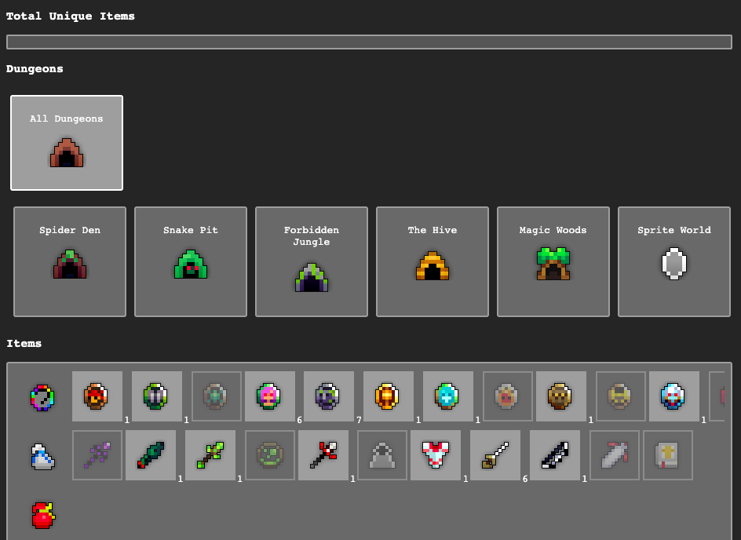

<p align="center">
<h3 align="center">ROTMG Collection Log (<i>incomplete</i>)</h3>
  <p align="center">
  An item collection log for <i><a title="ROTMG" href="https://en.wikipedia.org/wiki/Realm_of_the_Mad_God" target="_blank" rel="noreferrer">Realm of the Mad God</a></i>.
    <br />
</p>

### Built With

* [React](https://github.com/facebook/react)
* [Next.js](https://github.com/vercel/next.js/)


## Getting Started

To get a local copy up and running follow these simple steps.


### Installation

1. Clone the repo
   ```sh
   git clone git@github.com:mudassarzahid/rotmg-collection-log.git
   ```
2. Install required packages
   ```sh
   yarn install
   ```
3. Run the app
   ```sh
   yarn dev
   ```


## Usage example
<span align="center">

</span>
